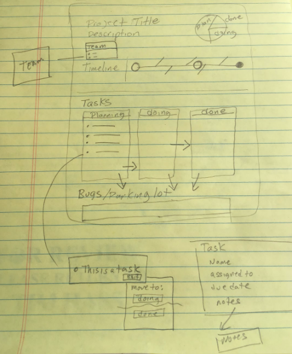
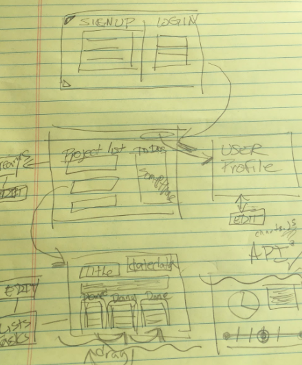
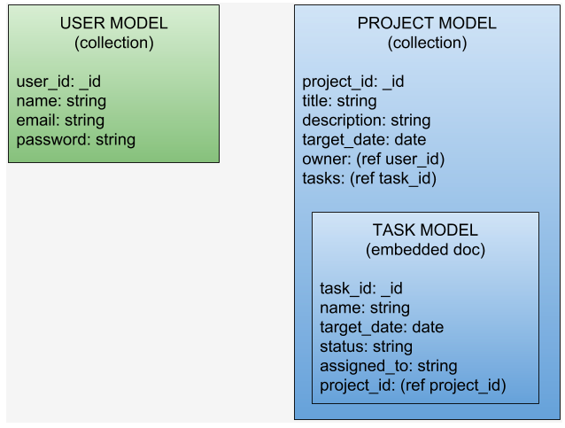
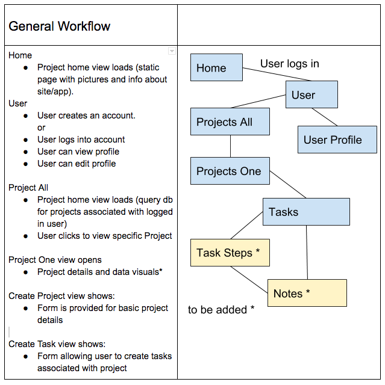

# Project Workflow Organizer

Project 3 - GA

Team: Zakir B, Daniel V, Tim H
- [Hosted App](https://kanbantaskmaster.herokuapp.com/)

- [Zakir B && Team Github](https://github.com/zakirb/workflow-organizer-project-3)
- [Dan V Github](https://github.com/danielrvancura/workflow-organizer-project-3)
- [Tim H Github](https://github.com/Tim-Hass-GA/workflow-organizer-project-3)

## User Stories:
- Gene is the owner of a small start-up business and needs a way to keep his handful of employees on task. {insert site name here} helps by allowing Gene to add team members and assigning tasks to each one and monitor their progress.
- Mary is a single mother of 3 and working two jobs and uses {insert site name here} to keep track of the chores and homework her kids are doing while she’s at work. She can sign in on her phone and see what has been done and what’s remaining.

## Technologies Used
This project was bootstrapped with [Create React App](https://github.com/facebookincubator/create-react-app).

Redux, Redux-Thunk, React, React-Router, MongoDB, Mongoose, Express, Express-JWT, Passport, Bcrypt, Body-Parser, Connect-Flash, Cookie-Parser, DotEnv, JSONWebToken, Materialize UI

## Getting Started
* Run `npm install` to install dependencies at root
* Run `npm install` to install dependencies in /client

### Wire Frames

### Models

### CRUD Routes
Verb | Path | Action | Used for
------------ | ------------- | ------------ | -------------
GET | / | read | - returns index/home page
GET | /useraccess | read | - returns the signup and login component (if no user token), returns user profile page (if token present)
POST | auth/signup | create | - receives data from signup component, checks for user account and returns created user or user profile page
POST | auth/login | create | - receives data from login component confirms user account and password credentials
POST | auth/me/from/token | create | - creates and stores access token
GET | /projects | read | - returns project component
POST | /project | create | - creates a new project
DELETE | /project | delete | - deletes a project
POST | /task | create | - creates a new task for the current project
PUT | /project | update | - update a project
PUT | /taskstatus | update | - updates the status of a task for the current project

### CRUD Routes (incomplete)
Verb | Path | Action | Used for
------------ | ------------- | ------------ | -------------
GET | edit/profile/:id | read | - returns form to update the user profile
PUT | update/user/:id | update | - updates user profile data
DELETE | delete/user/:id | delete | - deletes user profile and all associated data
DELETE | /task | delete | - deletes a task
PUT | /task | update | - update a task for the current project

#### Development Process
##### Day 1 (Sunday)
- Brainstorm ideas for project, decided on technologies, design wireframes, discussed data/model needs and app workflow,
- Created GitHub repo and set up local branches, discussed the workflow for the week, milestones
Researched topics new to the team

##### Day 2 (Monday)
- Imported agreed upon technologies, refactored existing pages with some Material-UI examples, created site skeleton, begin building navigation, models and basic views, refactoring views and adding needed components, implemented redux and store.

#### Day 3 (Tuesday)
- Continued developing routes and components, and building models, developed user stories, researched Material UI, mongoose and mongoD.

#### Day 4 (Wednesday)
- Seeded Projects Model, continued working on forms and implementation of Material UI, issues with embedded docs on the model schemas delayed us, pulled some functionality from original spec.

#### Day 5 (Thursday)
- Continued creating components, working on the store state and connections to database, began building routes, refactoring of form items

#### Day 6 (Friday)
- Refactoring components, refining styles, found a race issue for edit projects and edit tasks,

#### Day 7 (Saturday)
- Implemented Kanban Board, battling racing conditions....

#### Day 8 (Sunday)
- Finalizing styling on pages, completed edit project route, cleaned up code

#### unsolved problems && major hurdles
- racing issues
